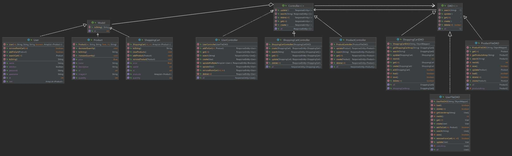
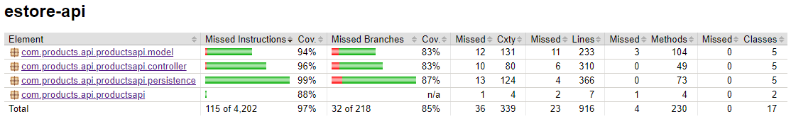

# PROJECT Name: RARAJ

# PROJECT Design Documentation

> _The following template provides the headings for your Design
> Documentation.  As you edit each section make sure you remove these
> commentary 'blockquotes'; the lines that start with a > character
> and appear in the generated PDF in italics._

## Team Information

* Team name: G-Force
* Team members
  * Aidan Collins
  * Antar Narayan Chowdhury
  * James De Luca
  * Richard Sawh
  * Robert Tetreault

## Executive Summary

### A food ordering website where users can select products they want, add them to their carts, and have their orders delivered after checking out.

### Purpose

The purpose of this project is to create a website that allows users to order food from a variety of cultures. The website will allow users to create an account, select food products from a variety of cultures, add them to their cart, and have their orders delivered after checking out. Admins/Owners will be able to add more inventory, delete from the inventory, and edit the inventory, but they will not be able to have their own carts.

### Glossary and Acronyms

| Term      | Definition                                                                     |
| --------- | ------------------------------------------------------------------------------ |
| Admin     | The owner or admin of the website who can add, delete, and edit the inventory. |
| Cart      | The list of products that the user wants to order.                             |
| Customer  | The user of the website who can add products to their cart, and check out.     |
| Inventory | The list of products that the admin can add, delete, and edit.                 |
| Products  | The food items the users can order.                                            |
| DAO       | Data Access Object                                                             |
| Model     | The model is the data that is stored in the database.                          |
| JSON      | JavaScript Object Notation                                                     |

## Requirements

* Be able to select items from the menu and add them to a cart
* Be able to search for an item instead of selecting it from the menu
* Be able to check out from the cart and place the order
* Be able to add or remove items from the menu as an admin
* Be able to view the current ongoing orders as an admin
* Be able to view the past orders as an admin
* Be able to view the current inventory as an admin
* Be able to edit the current inventory as an admin
* Be able to delete items from the inventory as an admin
* Be able to add items to the inventory as an admin
* Be able to view the current ongoing orders as a customer
* Be able to view the past orders as a customer
* Be able to view the current inventory as a customer

### Definition of MVP

The MVP is the minimum viable product. It is the minimum amount of features that the website must have to be considered a working website.

### MVP Features

The MVP features are the features that are required for the MVP. The MVP features for this project are to have a website that allows users to order food from a variety of restaurants/stores. The website will allow users to create an account, select products from a variety of restaurants, add them to their cart, and have their orders delivered after checking out. Admins/Owners will be able to add more inventory, delete from the inventory, and edit the inventory, but they will not be able to have their own carts.

### Roadmap of Enhancements

The roadmap of enhancements are the features that are not required for the MVP, but are features that would be nice to have. The roadmap of enhancements for this project are to have a website that processes payments securely, and allows users to rate the restaurants/stores they order from.

## Application Domain

## Architecture and Design

### Summary

The following Tiers/Layers model shows a high-level view of the webapp's architecture.

The e-store web application, is built using the Model–View–ViewModel (MVVM) architecture pattern.

The Model stores the application data objects including any functionality to provide persistance.

The View is the client-side SPA built with Angular utilizing HTML, CSS and TypeScript. The ViewModel provides RESTful APIs to the client (View) as well as any logic required to manipulate the data objects from the Model.

Both the ViewModel and Model are built using Java and Spring Framework. Details of the components within these tiers are supplied below.

### Overview of User Interface

This section describes the web interface flow; this is how the user views and interacts
with the e-store application.

Summary of the user interface flow:

1. The user opens the e-store web application in a browser.
2. The user is presented with the home page.
3. The user can navigate to the login page.
4. The user can navigate to the register page.
5. The user can navigate to the menu page.
6. The user can navigate to the cart page.
7. The user can navigate to the checkout page.
8. The user can navigate to the order history page.
9. The user can navigate to the order history page.
10. The user can navigate to dark/light mode.
11. The user can navigate to the coupon.
12. The user can naviagate to the user settings page where they can changer their personal informations.

### View Tier

Summary the View tier components and their interactions with the other tiers.

1. The View tier is built using Angular.
2. The View tier is a client-side application.
3. The View tier communicates with the Model tier using RESTful APIs.
4. The View tier communicates with the ViewModel tier using RESTful APIs.

> _You must also provide sequence diagrams as is relevant to a particular aspects
> of the design that you are describing.  For example, in e-store you might create a
> sequence diagram of a customer searching for an item and adding to their cart.
> Be sure to include an relevant HTTP reuqests from the client-side to the server-side
> to help illustrate the end-to-end flow._

### ViewModel Tier

Summary the ViewModel tier components and their interactions with the other tiers.

1. The ViewModel tier is built using Java and Spring Framework.
2. The ViewModel tier is a server-side application.
3. The ViewModel tier communicates with the Model tier using RESTful APIs.
4. The ViewModel tier communicates with the View tier using RESTful APIs.

> _At appropriate places as part of this narrative provide one or more
> static models (UML class diagrams) with some details such as critical attributes and methods._

### Model Tier

Summary the Model tier components and their interactions with the other tiers.

1. The Model tier is built using Java and Spring Framework.
2. The Model tier is a server-side application.
3. The Model tier communicates with the ViewModel tier using RESTful APIs.
4. The Model tier communicates with the database using JDBC.

> _At appropriate places as part of this narrative provide one or more
> static models (UML class diagrams) with some details such as critical attributes and methods._

### Static Code Analysis/Design Improvements

To really improve the website, more functionality could be added, such as ratings and tracking information. More testing could also be done to ensure full functionality and reliability. The website could also be made more secure by adding more security features such as a password reset, and two-factor authentication. In the future, custom themes could be used instead of the basic dark/light versions along with custom font sizing as well. Some other minor updates could be the addition of more user roles, account transferring, and automatic coupon/deal creation based on holidays.

> _With the results from the Static Code Analysis exercise,
> discuss the resulting issues/metrics measurements along with your analysis
> and recommendations for further improvements. Where relevant, include
> screenshots from the tool and/or corresponding source code that was flagged._

## Testing

Our testing was done using JUnit and Jacoco. We tested the following:

* The DAOs
* The Controllers
* The Models
* The Services
* The Views

### Acceptance Testing

> _Report on the number of user stories that have passed all their
> acceptance criteria tests, the number that have some acceptance
> criteria tests failing, and the number of user stories that
> have not had any testing yet. Highlight the issues found during
> acceptance testing and if there are any concerns._

#### User stories that pass acceptance critera

* Get Entire Inventory
* Create New Product
* Get a Single Product
* Update a Product
* Search for a Product
* Delete a Single Product
* Login as a Customer
* Login as an Admin
* Register as a Customer
* Register as an Admin
* Add an Item to the Cart
* Remove an Item from the Cart
* View the Cart

### Unit Testing and Code Coverage

We tested for each function in all of our API files so that we ensured that everything would be reliable. Our coverage is not 100% in total but it is quite close (%96). The anomalies are caused by certain functions that cannot be tested yet since they are meant for future use, and some of the getter and setter functions cannot be testable because of the code being nested. The main functionalities of the program was tested, and the results were matched with the expected results

* The com.products.api.productsapi.controller (%96):
  * UserController (%95): Most of the code is covered by the unit test. However, because of the code some parts are nested, the code cannot be covered. Moreover, the code checks same conditions with different approches, because of that the unit test cannot be applied to check these parts. Some of the checks already covered with other classes because of that it cannot be checked by the unit tests.
  * ProductController (%95): Most of the code is covered by the unit test. However, because of the code some parts are nested, the code cannot be covered.
  * OrderController (%95):  Most of the code is covered by the unit test. However, because of the code some parts are nested, the code cannot be covered.
  * AddressController (%100) :Covered all the methods with unit tests.
  * CouponController (%100): Covered all the methods with unit tests.
* com.products.api.productsapi.persistence (%99):
  * UserFileDAO (%98): Some of the checks already covered with other classes because of that it cannot be checked by the unit tests.
  * ProductFileDAO (%98): Some of the checks already covered with other classes because of that it cannot be checked by the unit tests.
  * CouponFileDAO (%98): Some of the checks already covered with other classes because of that it cannot be checked by the unit tests.
  * AddressFileDAO (%100): Covered all the methods with unit tests.
  * OrderFileDAO (%100): Covered all the methods with unit tests.
* com.products.api.productsapi.model (%94):
  * User (%92): Some of the checks already covered with other classes because of that it cannot be checked by the unit tests. Some of the method cannot testable because of the other unit test already checks the lines.
  * Address (%100): Some of the checks already covered with other classes because of that it cannot be checked by the unit tests.
  * Order (%96): Some of the checks already covered with other classes because of that it cannot be checked by the unit tests.
  * Product (%96):Covered all the methods with unit tests.
  * Coupon (%100): Covered all the methods with unit tests.

#### Design Principles Analysis

The current backend design followed the Single Responsiblity, Low Coupling, Pure Fabrication, and the dependency inversion.

* Single Responsibility: Except for the UserController.java class, all other classes have only single responsibilities, for example, Address.java creates the address as a model, AddressFileDAO has the responsibility to access the addresses, and the controller for the Address makes able to control the address object in the backend. However, the current project is dependent on the user object in every feature in the backend and front, the UserController has connections to other controllers. For the future, the team can recheck the UserController.java again and modify the code for the Single Responsibility.
* Low coupling: In the backend, we used interfaces and abstract classes the separate the common classes individually. The common feature was created first and then the uncommon feature was implemented individually and tested with separate unit tests. During the previous sprints, sometimes the team needed to change several parts of the code. Because the team implemented code based on the Low coupling principle, new additions were implemented easily and debugged easily. In the future sprints, if the team needs to add a new feature to the project, they can easily add it.
* Pure Fabrication: For the backend, we used the abstract classes and interfaces for the Pure Fabrication, and also we used the model classes for just accessing the object's basic features/properties in the backend. Because of that, when the team implemented the code they can use the model file to access the basic features and modify them in the program. In the future, the team can improve these classes (the model, abstract classes, and interfaces), and add more features if they need them.
* The dependency inversion: Because the backend uses the RestAPI model (persistence, model, and controller), the program is not dependant on the low-level modules. For example, the UserController.java only instantiates the other controllers, not the DAOs and models. In the future, the team needs to continue the same design when they want to new features to the project.

The current frontend design followed the Information Expert, Low Coupling, Pure Fabrication, and the Law of Demeter.

* Information Expert: In the frontend, we used a datatransfer service which allowed us to use Information Expert to its full capabilities. DataTransferService allows us to list all individual components of the frontend and those components only perform one specific function and by listing those components in DataTransferService, we can call those compnents and its functions in other files as well. The team has Information Expert fairly well covered.
* Low coupling: In the frontend, we used different folders that contain different components. For example, there are the checkout components, coupon components, and menu components which all perform one function. Due to using Low Coupling, it makes fixing bugs and adding new features incredibly easy and much simpler. For the future if the team needs to add new features or fix bugs, it is now easier.
* Pure Fabrication: In the frontend, we used seperate files for components in order to use Pure Fabrication . This allows the team to easily implement more code and access basic features in other files as well. In the future more functionality/features can be added.
* Law of Demeter: In the frontend, Law of Demeter was used to make sure that no component has access to the inner workings of another component or object, this way nothing important can be accidentally changed. This makes it easier to isolate different components and provide encapsulation so that everything fits together nicely. In the future, the team needs to continue to use Law of Demeter to make the code as efficient as possible.
